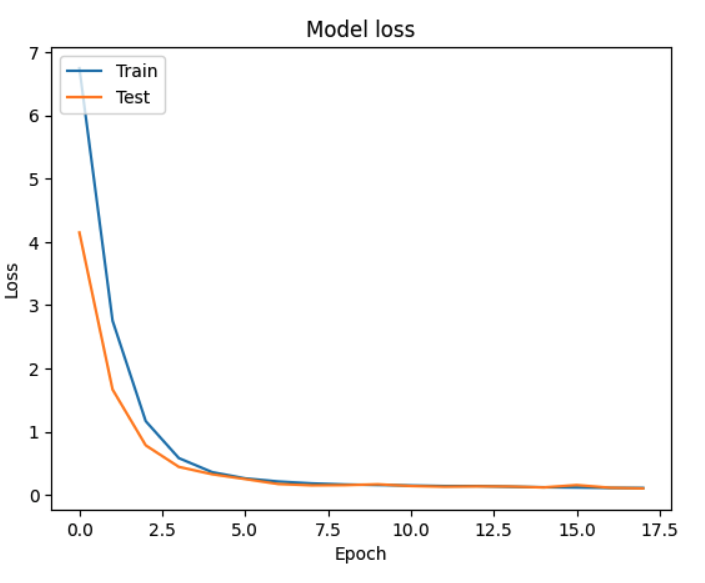
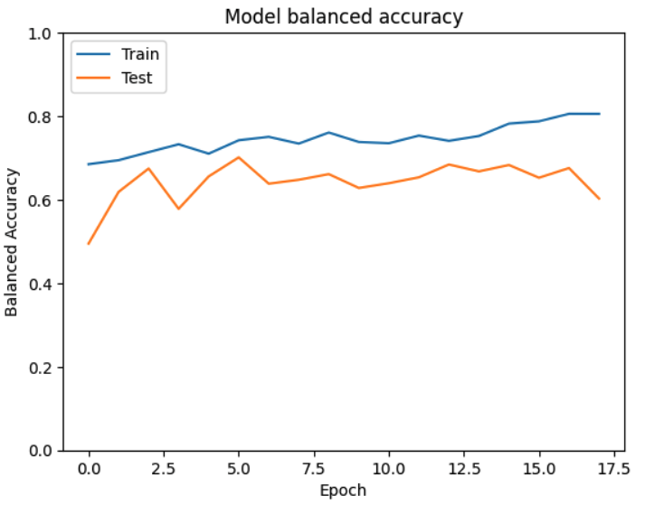
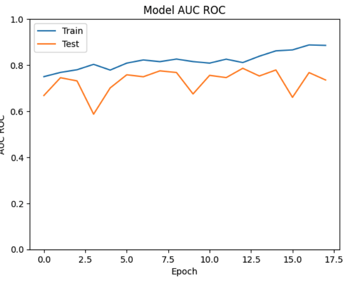
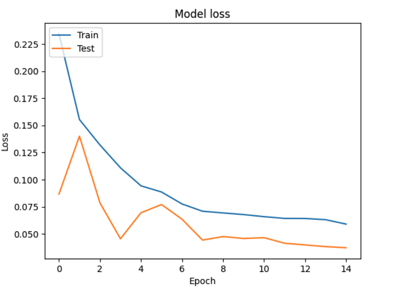
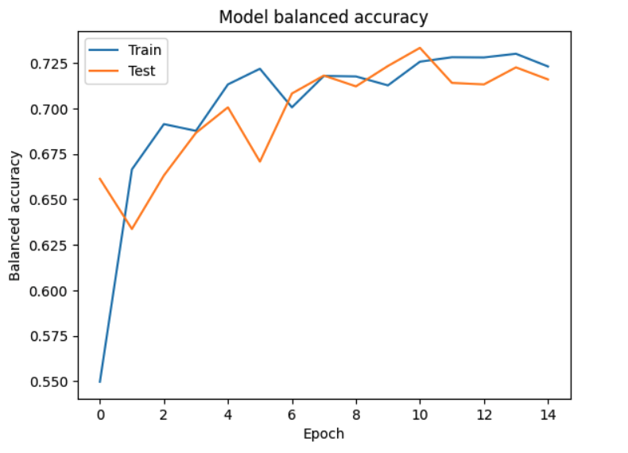

# Melanoma Classification - Deep learning Pipeline (ISIC dataset)

This repository implements a complete deep learning pipeline for melanoma classification using the ISIC skin lesion dataset. It explores a custom CNN and more advanced models like EfficientNetB2 and Vision Transformers (ViT), tackling real-world challenges such as extreme class imbalance, overfitting, and generalization to rare samples.

## Key Features

✅ Custom CNN trained from scratch (implemented in tensorflow)

✅ Transfer learning with EfficientNetB2 + fine-tuning 

✅ Vision Transformer (ViT) support

✅ Synthetic data generalisation using Stable Difusion via Hugging Face 🤗 

✅ Class imbalance handling: augmentation, weighting, and Focal Loss

✅ Regularization: Dropout + L2 weight decay 

✅ Custom training loop with metrics, callbacks, and Comet logging

✅ Learning rate scheduling (CosineDecay, PolynomialDecay)

✅ Modular pipeline structure wuith config-based experiment management 

## Class imbalance handling
The ISIC dataser is highly imbalanced (very few melanoma samples 1.7\% of melanoma positive pictures). The dataset can be found here: https://challenge2020.isic-archive.com/ 

The issue is addressed using the following twiks:

### 1. Class weights
 Dynamically computed using sklearn's compute_class_weight() and passed into model.fit(class_weight=...).

### 2. Selective data augmentation 
The augmentation is applied only to the positive class (aka target = 1). The augmentation includes: 

   -- random_flip_left_right\
   -- random_flip_up_down\
   -- random_brightness\
   -- image.random_contrast\
   -- rot90\
   -- random_hue\
   -- transpose\
   -- rot90(image, k=tf.random.uniform(shape=[], minval=0, maxval=4, dtype=tf.int32))\
   -- random_saturation(image, 0.5, 1.8)\
   -- image.random_jpeg_quality(image, 70, 90)\

💡 Note: Although libraries like Albumentations can be used, TensorFlow’s native ops (inside a @tf.function) are faster.

### 3. Special losses
Focal loss, specifically BinaryFocalCrossentropy(), is used to emphasize learning on harder to classify samples (https://arxiv.org/pdf/1708.02002 )

💡 Note: Another loss was considered which is supposed to perform better for highly imbalanced data - LDAM loss, which have been inplemented in tensorflow, enspired by  https://github.com/kaidic/LDAM-DRW
However, this loss is only for multi-class, in order to use it for two classes, one needs to remove the activation in the last dense layer, which is not optimal. 

### 4. Learning Rate schedulers 
Lr schedulers tend to help to reduce overfitting significantly. Use CosibeDecay lr shcedular. Shows much better performance then the static learning rate. 
PolynomialDecay scheduler is also implemented for the test purposes. 

## Evaluation Metrics

Standard binary accuracy is very misleading for highly imbalanced data. This doesnt seem to be addressed in the majority papers where ISIC data is classified using NN. Instead of classical accuracy following metrics are more tracked:

1. Balanced Accuracy:\
The average of sensitivity (recall for the positive class) and specificity (recall for the negative class). This is implemented as a custom metric to fairly evaluate performance across both classes.

2. AUC (ROC) and AUC (PR):\
These metrics assess the quality of ranking and are less biased by class imbalance. AUC-PR is especially informative when positives are rare.

3. Recall:\
Arguably the most critical metric for melanoma detection, as it reflects the model’s ability to minimize false negatives. In medical applications, missing a positive case (false negative) can be far more dangerous than a false alarm.

## Custom CNN model
The baseline model is a convolutional neural network consisting of :

Three convolutional blocks:
 
   -- Conv2D layers + BatchNorm + ReLU + MaxPolling + Dropout (0.3, 0.4 and 0.5 in each conv block)
   -- L2 regularization applied to convolutional layers (0.01)
   
Delse layers for classification with last signmoid activation 

### Training configurations 
The model configuration, the training configuration as well as model setup can be found in Melanoma_Classifier/configs/ (model/customCNN.yaml)

Due to limit resoursses, first the model has been prototyped in Google Colab notebook: https://colab.research.google.com/drive/15iZRsk7ALNFwI0LnjF6MqXW0u0ScOkrn?usp=sharing. Then, fully migrated to this modular training pipeline. 

A hyperparameter scan was also performed to find the optimal number of filters, dropout rates, strides, and other model parameters.

The model performed best with:

* tem batch_size = 16

* start learning_rate = 1e-4

* CosineDecay learning rate scheduler enabled with min lr=1e-5

* Early stopping based on validation Recall 

* The BinaryFocalCrossEntropy loss has been optimized for best performance, with gamma factor = 3 

### Evaluation strategy 

The primary evaluation metrics used were Recall, Balanced Accuracy, and AUC (ROC) — all of which are critically important for handling the highly imbalanced nature of the ISIC 2020 melanoma dataset.

To improve performance and generalization, an ensemble of custom CNN models was used to make the final predictions. Each model in the ensemble was trained with a specific focus:

1. One optimized for maximum recall

2. One for best balanced accuracy

3. One for highest AUC (ROC)

The predictions of these models were then averaged to produce the final output. \
Validation result on the Ensemble of models:\

 -- Validation Balanced Accuracy: 71%

 -- Validation AUC (ROC): 79% 

 -- Recall 71%

 -- Accuracy 72%
 
 
 
  

### Dataset handling

The original ISIC dataset consists of high-resolution dermoscopic images, which are computationally expensive to train on, especially for mid-sized custom CNNs. Therefore, images were resized to 256×256 resolution (see notebook https://github.com/annaivina/Melamoma_Classifier/blob/main/datasets/Inspect_Datasets.ipynb )

The lables are provided in the csv file together with additional information https://github.com/annaivina/Melamoma_Classifier/blob/main/datasets/ISIC_2020_Training_GroundTruth.csv 

Additionally, the CSV file containes other information such as sex, age, ect. \
A correlation analysis was performed to assess whether metadata like age or sex could assist prediction. Correlation coefficients were found to be low:

|            | sex      | age_approx | target   |
|------------|----------|------------|----------|
| sex        | 1.000000 | 0.109827   | 0.027604 |
| age_approx | 0.109827 | 1.000000   | 0.086388 |
| target     | 0.027604 | 0.086388   | 1.000000 |

Demographic features were not included in the model as they showed no strong correlation with the target.

To ensure the target class (melanoma = 1) is fairly represented in both the training and validation sets, the data was stratified manually as follows:

1. Separate Class Labels:\
The dataset was split into two subsets based on the target label (target = 0 and target = 1).

2. Stratified Split:\
An 80:20 split was applied to each class separately, ensuring that the rare positive class (target = 1) has sufficient representation in both sets.

3. Balanced Merge:\
The resulting train/validation subsets were then recombined, maintaining a similar class distribution in both sets. This helps the model generalize better and prevents skewed evaluation metrics due to class imbalance.

## Experimnetations and Model extensions

In addition to the custom CNN, modern architectures and techniques were explored, including EfficientNet and Vision Transformers (ViT).

### Transfer Learning + Fine-tuning (EfficientNetB2):

EfficientNetB2, pretrained on ImageNet, was chosen as it offers a good trade-off between model size and performance. Most EfficientNet variants require high-resolution inputs, so 260×260 was selected to match EfficientNetB2's expected input size and to stay close to the custom CNN configuration for the comparison purposes. 

Two-stage fine-tuning strategy is adopted:

1. Feature Extraction - All EfficientNetB2 layers frozen; a GlobalAveragePooling layer and a top dense classifier with Dropout(0.5) were added.
2. Fine-tuning - The last 10 layers of the EfficientNetB2 backbone were unfrozen and retrained.(BatchNorm layers are left frozen)

#### Training Configuration:
 -- Loss: BinaryFocalCrossEntropy with gamma=3, label_smoothing=0.0\
 -- Optimizer: Adam\
 -- LR (feature extraction): 1e-4 (constant)\
 -- LR (fine-tuning): 1e-5 (cosideDecay)\
 -- Early stopping: patience=2, monitoring val_loss (feature extraction); patience=5, monitor val_balanced_accuracy (fine-tuning)

#### Results after fine-tuning 
Balanced accuracy: 67%

AUC (ROC): 78%

These are solid results considering the model size and training limits. Further improvements could likely be achieved using larger variants such as EfficientNetB6, which were not tested here due to resource constraints. Also they would probablly overfit much faster taking into account the small size of the dataset. 

The number of frozn layers were also studies, but the best performance was achived with last 10 layers unfrozn. 

## Vision Transformer (ViT) with Custom CNN Backbone
In this hybrid model architecture, a custom-built CNN is used as a feature extractor, while a Vision Transformer (ViT) is trained on top of its frozen outputs.

Unlike traditional ViTs that split raw images into fixed-size patches, here the input to the ViT is the output of the CNN's feature_extractor layer, with shape (None, 7, 7, 128). This approach allows us to:

 -- Leverage convolutional inductive bias early on,

 -- Reuse well-learned spatial features,

 -- And offload heavy low-level computation to the CNN.

### ViT Architecture
1. Patch Embedding:

The CNN output is reshaped to serve as patch tokens.

A Dense layer projects them to the desired embedding dimension.

Positional embeddings are added to retain spatial awareness.

2. Transformer Encoder:

2 Transformer blocks (multi-head self-attention + MLP).

Number of heads: 12.

Dropout and layer normalization applied appropriately.

3. Output Head:

Global average pooling,

Followed by a classification head (MLP).

### Training Strategy & Key Insight
During experimentation, it was observed that the ViT performs best when the CNN backbone was trained and saved based on the highest Recall, rather than more common metrics like accuracy and loss.

This choice is not a standard practice — most models monitor general-purpose metrics like loss or accuracy. However, in the context of medical imaging with extreme class imbalance, this choice is both rational and impactful.

False negatives are costly: Missing a melanoma case can have serious consequences.

Recall emphasizes sensitivity: A model optimized for recall is more likely to catch these rare positive cases.

This gives the ViT access to more informative features, especially for minority class learning.

🧠 While not commonly done, using Recall as the selection metric for CNN weights proved highly effective and improved all downstream metrics when used as a ViT backbone.

### Results

-- Balanced Accuracy 73%

-- Recall 76%
 
-- AUC (ROC) 81%

-- Accuracy 70%

## Benchmarking Against Published Work
 
These results were compared to other works on melanoma classification. While some report high accuracy or AUC, most:
   -- do not provide full evaluation metrics (especially recall or balanced accuracy)
   -- do not address class imbalance beyond basic data augmentation

Referenced papers: 
 1. https://www.nature.com/articles/s41598-024-75143-4 
 2. https://link.springer.com/article/10.1007/s11042-022-13847-3 
 3. https://arxiv.org/pdf/2010.05351 