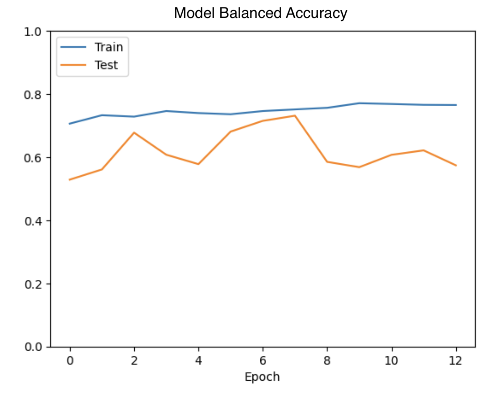

# Melanoma Classification - Deep learning Pipeline (ISIC dataset)

This repository implements a complete deep learning pipeline for melanoma classification using the ISIC skin lesion dataset. It explores a custom CNN and more advanced models like EfficientNetB2 and Vision Transformers (ViT), tackling real-world challenges such as extreme class imbalance, overfitting, and generalization to rare samples.

## Key Features

✅ Custom CNN trained from scratch (implemented in tensorflow)

✅ Transfer learning with EfficientNetB2 + fine-tuning 

✅ Vision Transformer (ViT) support

✅ Synthetic data generalisation using Stable Difusion via Hugging Face 🤗 

✅ Class imbalance handling: augmentation, weighting, and Focal Loss

✅ Regularization: Dropout + L2 weight decay 

✅ Custom training loop with metrics, callbacks, and Comet logging

✅ Learning rate scheduling (CosineDecay, PolynomialDecay)

✅ Modular pipeline structure wuith config-based experiment management 

## Class imbalance handling
The ISIC dataser is highly imbalanced (very few melanoma samples). The dataset can be found here: https://challenge2020.isic-archive.com/ 

The issue is addressed using the following twiks:

### 1. Class weights
 Dynamically computed using sklearn's compute_class_weight() and passed into model.fit(class_weight=...).

### 2. Selective data augmentation 
The augmentation is applied only to the positive class (aka target = 1). The augmentation includes: 

   -- random_flip_left_right\
   -- random_flip_up_down\
   -- random_brightness\
   -- image.random_contrast\
   -- rot90\
   -- random_hue\
   -- transpose\
   -- rot90(image, k=tf.random.uniform(shape=[], minval=0, maxval=4, dtype=tf.int32))\
   -- random_saturation(image, 0.5, 1.8)\
   -- image.random_jpeg_quality(image, 70, 90)\

💡 Note: Although libraries like Albumentations can be used, TensorFlow’s native ops (inside a @tf.function) are faster.

### 3. Special losses
Focal loss, specifically BinaryFocalCrossentropy(), is used to emphasize learning on harder to classify samples (https://arxiv.org/pdf/1708.02002 )
Additionally, label smoothing of 0.1 is applied to reduce overconfidence in the predictions and improve generalization

💡 Note: Another loss was considered which is supposed to perform better for highly imbalanced data - LDAM loss, which have been inplemented in tensorflow, enspired by  https://github.com/kaidic/LDAM-DRW
However, this loss is only for multi-class, in order to use it for two classes, one needs to remove the activation in the last dense layer, which is not optimal. 

### 4. Learning Rate schedulers 
Lr schedulers tend to help to reduce overfitting significantly. Use CosibeDecay lr shcedular. Shows much better performance then the static learning rate. 
PolynomialDecay scheduler is also implemented for the test purposes. 

## Evaluation Metrics

Standard binary accuracy is very misleading for highly imbalanced data. This doesnt seem to be addressed in the majority papers where ISIC data is classified using NN. Instead of classical accuracy following metrics are more tracked:

1. Balanced Accuracy : Everage of sensitivity ansd specificity (applied as custom metric)
2. F1 score  which is focued on the balance between precidion and recall 
3. AUC (ROC) and AUC(PR) metrics better suiting for this task 

## Custom CNN model
The baseline model is a convolutional neural network consisting of :

Three convolutional blocks:
 
   -- Conv2D layers + BatchNorm + ReLU + MaxPolling + Dropout (0.3, 0.4 and 0.5 in each conv block)
   -- L2 regularization applied to convolutional layers (0.01)
   
Delse layers for classification with last signmoid activation 

### Training configurations 
The model configuration, the training configuration as well as model setup can be found in Melanoma_Classifier/configs/ (model/customCNN.yaml)

Due to limit resoursses, first the model has been prototyped in Google Colab notebook: https://colab.research.google.com/drive/15iZRsk7ALNFwI0LnjF6MqXW0u0ScOkrn?usp=sharing. Then, fully migrated to this modular training pipeline. 

A hyperparameter scan was also performed to find the optimal number of filters, dropout rates, strides, and other model parameters.

The model performed best with:

* tem batch_size = 32

* start learning_rate = 1e-4

* CosineDecay learning rate scheduler enabled with min lr=1e-5

* Early stopping based on validati0on balanced accuracy 

* The BinaryFocalCrossEntropy loss has been optimized for best performance, with gamma factor = 3 

The evaluation metric used was balanced accuracy, which is critically important for highly imbalanced dataset like ISIC 2020. The best performance was recorded at epoch 8 where:

 -- Validation Balanced Accuracy: 73%

 -- Validation AUC (ROC): 79% 
 
 
 

 Despite both training and validation losses decreasing over time, the balanced accuracy starts to deteriorate, indicating that the model begins to overfit and favor the majority class (target = 0).
 

### Dataset handling

The original ISIC dataset consists of high-resolution dermoscopic images, which are computationally expensive to train on, especially for mid-sized custom CNNs. Therefore, images were resized to 256×256 resolution (see notebook https://github.com/annaivina/Melamoma_Classifier/blob/main/datasets/Inspect_Datasets.ipynb )

The lables are provided in the csv file together with additional information https://github.com/annaivina/Melamoma_Classifier/blob/main/datasets/ISIC_2020_Training_GroundTruth.csv 

Additionally, the CSV file containes other information such as sex, age, ect. \
A correlation analysis was performed to assess whether metadata like age or sex could assist prediction. Correlation coefficients were found to be low:

|            | sex      | age_approx | target   |
|------------|----------|------------|----------|
| sex        | 1.000000 | 0.109827   | 0.027604 |
| age_approx | 0.109827 | 1.000000   | 0.086388 |
| target     | 0.027604 | 0.086388   | 1.000000 |

Demographic features were not included in the model as they showed no strong correlation with the target.

The train data has been devided into train and validation sample with ratio 80:20. Thus train sample has 26k and validation 6k. The splitting can also be changed in the config file. 

## Experimnetations and Model extensions

In addition to the custom CNN, modern architectures and techniques were explored, including EfficientNet and Vision Transformers (ViT).

### Transfer Learning + Fine-tuning (EfficientNetB2):

EfficientNetB2, pretrained on ImageNet, was chosen as it offers a good trade-off between model size and performance. Most EfficientNet variants require high-resolution inputs, so 260×260 was selected to match EfficientNetB2's expected input size and to stay close to the custom CNN configuration for the comparison purposes. 

Two-stage fine-tuning strategy is adopted:

1. Feature Extraction - All EfficientNetB2 layers frozen; a GlobalAveragePooling layer and a top dense classifier with Dropout(0.5) were added.
2. Fine-tuning - The last 10 layers of the EfficientNetB2 backbone were unfrozen and retrained.

#### Training Configuration:
 -- Loss: BinaryFocalCrossEntropy with gamma=3, label_smoothing=0.1\
 -- Optimizer: Adam\
 -- LR (feature extraction): 1e-4 (constant)\
 -- LR (fine-tuning): 1e-5 (cosideDecay)\
 -- Early stopping: patience=2, monitoring val_loss (feature extraction); patience=5, monitor val_balanced_accuracy (fine-tuning)

#### Results after fine-tuning 
Balanced accuracy: 69%

AUC (ROC): 84%

These are solid results considering the model size and training limits. Further improvements could likely be achieved using larger variants such as EfficientNetB6, which were not tested here due to resource constraints.

### Vision Transformers 

<!-- 2. Vision Transformers 
3. Synthetic Sample Generation using Diffusion. 
    This is a big apportunity to test the stable difusion model image generation.
    The model which has been used is form hugging face transformers 🤗  located here: 
    This migh provide more balanced data configuration  -->

## Benchmarking Against Published Work
 
These results were compared to other works on melanoma classification. While some report high accuracy or AUC, most:
   -- do not provide full evaluation metrics (especially recall or balanced accuracy)
   -- do not address class imbalance beyond basic data augmentation

Referenced papers: 
 1. https://www.nature.com/articles/s41598-024-75143-4 
 2. https://link.springer.com/article/10.1007/s11042-022-13847-3 
 3. https://arxiv.org/pdf/2010.05351 